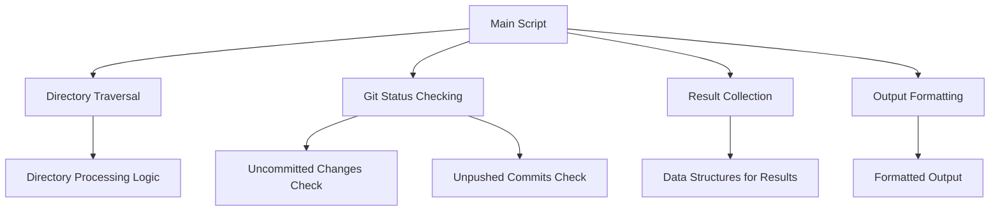
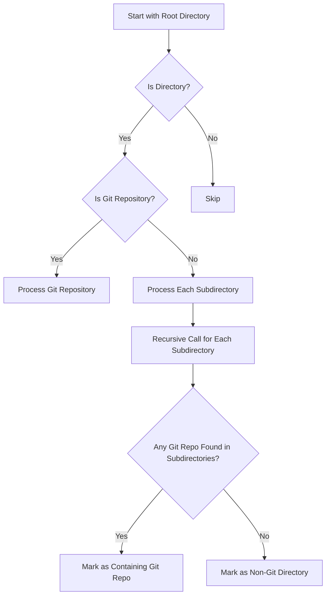
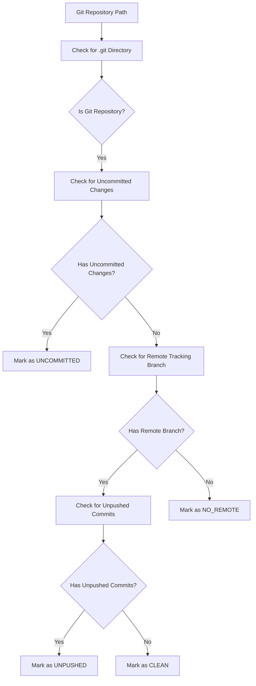

# Git Repository Status Checker - Design

## System Architecture

The Git Repository Status Checker is designed as a shell script that traverses a directory structure, identifies Git repositories, and reports their status. The system follows a modular design with clear separation of concerns.

### High-Level Components

## Core Algorithms

### Directory Traversal Algorithm

### Git Status Checking Algorithm

## Data Structures

The script will use the following data structures to track information:

1. **Git Repository List**: Stores paths of identified Git repositories along with their status
2. **Non-Git Directory List**: Stores paths of top-level directories that don't contain any Git repositories
3. **Processed Directory List**: Tracks directories that have already been processed to avoid redundant checks

## Key Functions

### 1. Main Script Logic

- Parse command-line arguments
- Validate input directory
- Initialize data structures
- Start directory traversal
- Generate and display results

### 2. Directory Traversal

- Check if current directory is a Git repository
- If yes, process it and add to Git repository list
- If no, recursively process subdirectories
- Track directories that have been processed

### 3. Git Status Checking

- Check if a directory is a Git repository
- Check for uncommitted changes (modified, staged, or untracked files)
- Check for unpushed commits
- Determine overall status of the repository

### 4. Result Collection and Output

- Collect results from traversal and status checking
- Format results into clear, readable output
- Display different categories of results (uncommitted, unpushed, non-Git)

## Performance Considerations

1. **Avoiding Redundant Checks**:
   - Once a directory is identified as a Git repository, skip traversal into its subdirectories
   - Maintain a list of processed directories to avoid checking the same directory multiple times

2. **Efficient Git Operations**:
   - Use optimized Git commands that minimize overhead
   - Use `--porcelain` format for machine-readable output
   - Avoid unnecessary Git operations (e.g., fetching from remote)

3. **Directory Traversal Optimization**:
   - Use native shell commands for directory traversal
   - Consider using `find` for more efficient directory traversal in large directory structures
   - Implement early pruning of known large directories that are unlikely to be Git repositories

4. **Handling Large Non-Git Directories**:
   - Explicitly skip common large directories that are known not to be Git repositories:
     - Node.js: `node_modules`
     - Python: `.venv`, `venv`, `env`, `.env`
     - Java/Maven: `target`
     - Build directories: `build`, `dist`
   - Skip these directories early in the traversal process before performing any Git operations
   - Use an explicit allowlist/denylist approach to make the skipping configurable

## Error Handling

1. **Input Validation**:
   - Validate that the specified root directory exists
   - Check for proper permissions to access directories

2. **Git Command Errors**:
   - Handle errors from Git commands gracefully
   - Provide meaningful error messages

3. **Edge Cases**:
   - Handle empty repositories
   - Handle repositories with detached HEAD
   - Handle repositories without remote tracking branches

## Implementation Approach

The implementation will be a shell script (Bash/Zsh) that uses standard Unix utilities and Git commands. The script will be structured in a modular way with clear separation of concerns:

1. **Initialization and Argument Parsing**:
   - Parse command-line arguments
   - Set up environment and variables

2. **Helper Functions**:
   - Functions for checking Git repository status
   - Functions for directory traversal
   - Functions for result collection and formatting

3. **Main Logic**:
   - Orchestrate the overall process
   - Call helper functions as needed
   - Generate and display results

4. **Output Formatting**:
   - Format results in a clear, readable way
   - Use color coding for different types of issues (if terminal supports it)
