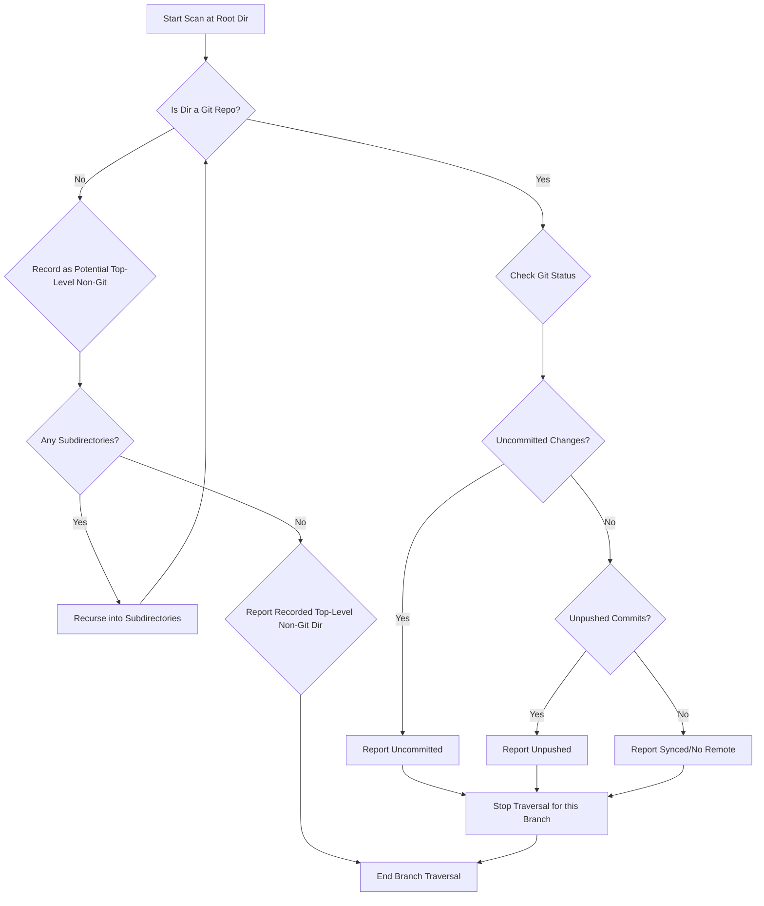

# Design for Git Status Scanner Script

## 1. Overview

The script will perform a depth-first traversal of the specified directory tree. At each directory, it checks for the presence of a `.git` directory or uses `git rev-parse` to confirm if it's a Git repository. Based on the result, it either checks the Git status or continues traversal. A mechanism is needed to track the highest-level non-Git directory encountered in a path if no Git repo is found deeper.

## 2. Core Logic



## 3. Key Components & Commands

3.1. **Directory Traversal:** Use `find` command (in Bash). The traversal should efficiently prune (skip descending into) directories that match the hardcoded ignore list (`node_modules`, `venv`, `.venv`, `env`, `.env`, `target`, `build`, `dist`) and also prune directories once a Git repository root (`.git` or identified via `rev-parse`) is found within them. Limit `find` to not cross filesystem boundaries if necessary.

3.2. **Git Repository Check:**
    - Inside a directory `D`: `git -C "$D" rev-parse --is-inside-work-tree` (returns `true` if Git repo, errors otherwise). Redirect stderr to `/dev/null`.

3.3. **Uncommitted Changes Check:**
    - Inside a Git repo `D`: `git -C "$D" status --porcelain`. If the output is non-empty, there are uncommitted changes (including untracked files).

3.4. **Unpushed Commits Check:**
    - Inside a Git repo `D`:
        - Check if remote upstream exists: `git -C "$D" rev-parse --abbrev-ref '@{u}'` (errors if no upstream).
        - If upstream exists, check for divergence: `git -C "$D" log '@{u}..' --oneline`. If the output is non-empty, there are local commits not on the remote.

3.5. **Tracking Non-Git Directories:**
    - When recursing, pass the path of the current potential top-level non-Git directory down.
    - If a Git repo is found deeper, this path is discarded for that branch.
    - If the recursion reaches leaf directories without finding a Git repo, the initially recorded path is reported.

## 4. Output Format (Console)

```
[STATUS] PATH
```
Examples:
```
[UNCOMMITTED] /Users/ksprashanth/code/my-project
[UNPUSHED]    /Users/ksprashanth/code/another-repo
[NON-GIT]     /Users/ksprashanth/code/temp-notes
[SYNCED]      /Users/ksprashanth/code/library-fork (Optional)
[NO REMOTE]   /Users/ksprashanth/code/local-experiment (Optional)
```

## 5. Implementation Language Choice

- **Bash:** Suitable due to direct use of Git CLI commands. Simpler for basic logic. `find` provides powerful traversal options.
- **Python:** Better for more complex state management (tracking non-Git roots), error handling, and potentially easier testing. `os.walk` is standard for traversal.

Bash is likely sufficient and potentially simpler for this specific task.
